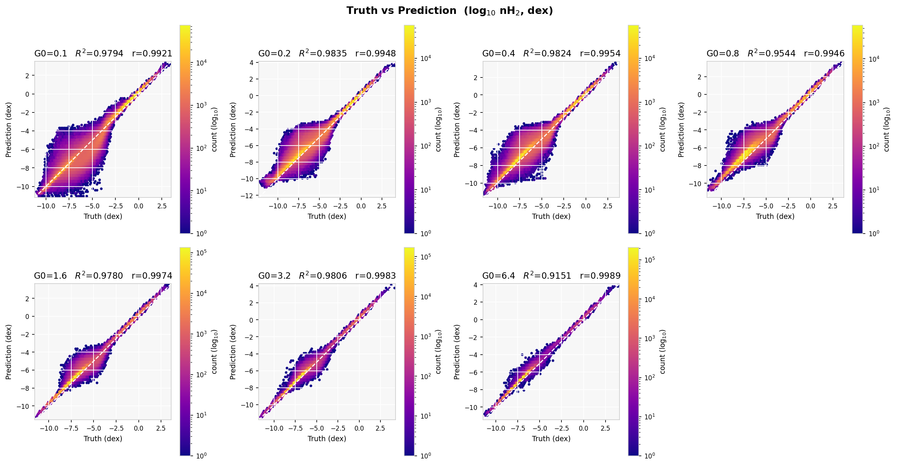

# ML surrogates for molecular hydrogen density in 3D ISM simulations

Machine-learning surrogates that predict the molecular hydrogen number
density `log10(nH2)` at every cell of three-dimensional interstellar-medium
(ISM) simulations, replacing an expensive non-equilibrium chemistry solver.
Tabular models (XGBoost, wide MLP) augmented with **multi-scale spatial
neighbourhood features** are compared against a volumetric **3D U-Net**
baseline under a strict out-of-distribution protocol: leave-one-G0-out
cross-validation over a seven-simulation UV-field sweep.

**Headline results** (log-space R², mean ± std over 7 held-out simulations):

| Model | R² |
|---|---|
| Ridge-stacked ensemble (XGBoost + MLP, spatial features) | **0.988 ± 0.013** |
| Wide MLP + spatial features | 0.968 |
| XGBoost + spatial features | 0.963 |
| 3D U-Net (best configuration) | 0.974 ± 0.035 |

The spatial features (box-filter means at 3/5/7-voxel scales, ~30 s to
compute for the full suite) improve every tabular model, and the tabular
pipeline trains in minutes on one consumer GPU — roughly two orders of
magnitude cheaper than the U-Net, with better robustness at the
extrapolation boundaries.



## Data

Seven `128³` uniform-grid simulations (14.7M cells total) of turbulent ISM
gas under UV radiation fields of strength `G0 ∈ {0.1, 0.2, 0.4, 0.8, 1.6,
3.2, 6.4}` Habing, sharing identical initial conditions — a controlled
single-parameter sweep. Each cell carries 15 input features (density,
temperature, ionisation, dust extinction, H2 self-shielding factor, G0,
velocity, face-centred magnetic field) and the target `nH2`, which spans
~16 orders of magnitude (all modelling is done in log space).

The cubes live in `icedrive-dl-182bd/UVonly/<G0>/` as CSV files tracked
with **Git LFS** — install [git-lfs](https://git-lfs.com/) before cloning,
or the data files will be broken pointers:

```bash
git lfs install
git clone <repo-url>
```

## Setup

Python ≥ 3.13 with: `numpy`, `pandas`, `scipy`, `scikit-learn`, `xgboost`,
`torch` (CUDA build recommended), `matplotlib`.

```bash
pip install numpy pandas scipy scikit-learn xgboost matplotlib
pip install torch --index-url https://download.pytorch.org/whl/cu126
```

Everything runs on a single consumer GPU (developed on an RTX 3090);
CPU-only works but is slow for the MLP/U-Net.

## Quick start

```bash
# Sanity check of the metrics suite (seconds, no data needed)
python smoke_test_metrics.py

# Simple pointwise baselines (linear / XGBoost / MLP)
python classical_models.py

# Full model comparison with leave-one-G0-out CV (~2.5 h on a 3090)
python compare_architectures.py
python compare_architectures.py --no-fh2      # solver-independent ablation
python compare_architectures.py --cnn         # include U-Net variants (slow)

# 3D U-Net training / focused CNN tests
python train_cnn.py
python test_cnn.py --variants unet_baseline

# Train the best model, predict a held-out cube, save prediction volumes
python predict_and_visualize.py --all

# Publication figures from the saved prediction volumes
python statistical_analysis.py --pred-dir predictions --save-dir analysis_output
python plot_model_comparison.py               # per-fold comparison figure
python plot_feature_importance.py             # XGBoost feature importances

# Supplementary experiments
python single_cube_extrapolation.py           # 7x7 cross-G0 transfer matrix
python intra_cube_section.py                  # within-cube sampling geometry
python merit_metrics.py                       # mass-budget / phase-conditional check
```

Every experiment writes a timestamped JSON log with the full configuration,
per-fold metrics, package versions, and a SHA-256 fingerprint of the input
data. See `RUN_PLAN.md` for the complete run book used for the paper.

## Repository layout

| Path | Role |
|---|---|
| `data_loader.py` | Loads the 7 cubes, defines features/target, data checksum |
| `classical_models.py` | Pointwise baselines + `compute_metrics` (central metric suite) |
| `model_helpers.py` | Shared training helpers, spatial features, bias recalibration |
| `cnn_model.py` / `augmentation.py` | 3D U-Net; z-preserving symmetry augmentation |
| `compare_architectures.py` | Main leave-one-G0-out comparison across all model families |
| `train_cnn.py` / `test_cnn.py` | U-Net training and variant tests |
| `predict_and_visualize.py` | Final stacked model; saves per-cube prediction volumes |
| `statistical_analysis.py` | Error-analysis figures (scatter, residuals, mass budget, slices) |
| `plot_model_comparison.py` / `plot_feature_importance.py` | Standalone paper figures |
| `single_cube_extrapolation.py` / `intra_cube_section.py` | Supplementary experiments |
| `merit_metrics.py` | Independent astrophysical sanity check of saved predictions |
| `arch_comparison_*.json`, `logs/`, `predictions/` | Archived experiment logs and outputs |
| `paper/` | RASTI LaTeX manuscript (`paper.tex`, `paper.pdf`) and review reports |
| `RUN_PLAN.md` | Run book: every command needed to regenerate the paper's data |

## Evaluation protocol

All headline numbers use **leave-one-G0-out cross-validation**: each fold
withholds an entire simulation at a UV field strength absent from training,
so the models are always tested out of distribution. Random cell-level
splits would leak the shared turbulent structure and inflate R² above 0.99.

Metrics are computed in log space by `compute_metrics`
(`classical_models.py`): RMSE decomposed into bias + scatter, total-H2
mass ratio, R², threshold accuracies (fraction within 0.1/0.3/0.5 dex),
phase-conditional errors (diffuse vs molecular gas), Lin's concordance
(CCC), Wasserstein distance (W1), and a skill score against the pointwise
XGBoost baseline. R² alone is not trusted: it is nearly blind to systematic
bias, which compounds exponentially in the mass budget — the pipeline
therefore audits and recalibrates the bias explicitly.

## Paper

The manuscript (`paper/paper.tex`, built PDF at `paper/paper.pdf`) is
prepared in the [RAS Techniques & Instruments](https://academic.oup.com/rasti)
LaTeX format. Build from `paper/` with `latexmk -pdf paper.tex`.

## Author

Daniel H. Breger, Department of Physics, Technion — Israel Institute of
Technology. The simulation suite is not yet public; contact the author for
data-access requests.
